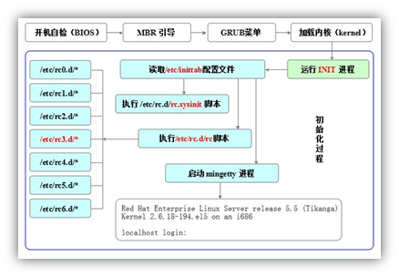

## linux守护进程  
1. 前台任务（foreground job）是独占命令行窗口的任务，只有运行完了或者手动中止该任务，才能执行其他命令。  
2. 后台任务（background job），与前台任务相对应，在多任务系统中，有一些任务在运行的时候，并不需要与用户交互。它们通常在不打扰用户其它工作的时候默默地执行（此时可以输入其他的命令）。后台任务继承当前session（对话，就是终端窗口）的标准输出（stdout）和标准错误（stderr）。因此，后台任务的所有输出依然会同步地在命令行下显示。不再继承当前session的标准输入（stdin）。你无法向这个任务输入指令了。如果它试图读取标准输入，就会暂停执行（halt）。  
3. 守护进程（daemon）是指在UNIX或其他多任务操作系统中在后台执行的电脑程序，并不会接受电脑用户的直接操控。此类程序会被以进程的形式初始化。守护进程程序的名称通常以字母“d”结尾：例如，syslogd就是指管理系统日志的守护进程。用户退出session之后，“后台任务是否会继续执行”是判定这一任务是否为“守护进程”的依据。
## linux服务
1. 守护进程就是服务在后台运行的真实进程
## linux服务管理器
1. 早期Sysv  
早期的linux系统服务的管理方式被称为 SysV ，特点是系统核心第一支呼叫的程序是 init ， 然后 init 去唤起所有的系统所需要的服务，不论是本地服务还是网络服务。系统启动的基本流程如下图:  
  
2. ubuntu层使用过一段时间的upstart  
Upstart 是一个基于事件的/sbin/init守护进程的替代品，它在系统启动过程中处理任务和服务的启动，在系统运行期间监视它们，在系统关机的时候关闭它们。
3. 现在的systemd  
systemd是一个新的初始化系统和系统管理器，它被用于所有主要的 Linux发行版，以取代传统的SysV初始化系统。  
systemd兼容SysV和LSB初始化脚本。它可以直接替代SysV 初始化系统。systemd 是被内核启动的第一个程序，它的PID 是1。  
systemd是所有程序的父进程，Fedora 15 是第一个用systemd 取代upstart的发行版。systemctl 用于命令行，它是管理 systemd的守护进程/服务的主要工具，例如：（开启、重启、关闭、启用、禁用、重载和状态）  
systemd使用 .service 文件而不是bash 脚本（SysVinit 使用的）。systemd 将所有守护进程添加到 cgroups中排序，你可以通过浏览/cgroup/systemd文件查看系统等级。

## sysv与systemd的区别
1. sysv的服务主要是/etc/init.d /etc/rc.d 中的脚本
2. systemd的服务主要是unit，其中包括service，socket等
3. systemd兼容sysv

## 内核初始化系统的7个阶段
0. 关机  
1. 单用户模式  
2. 多用户模式（没有NFS）  
3. 完全的多用户模式 (有网络) 
4. 系统未使用  
5. 图形界面模式  
6. 重启  

